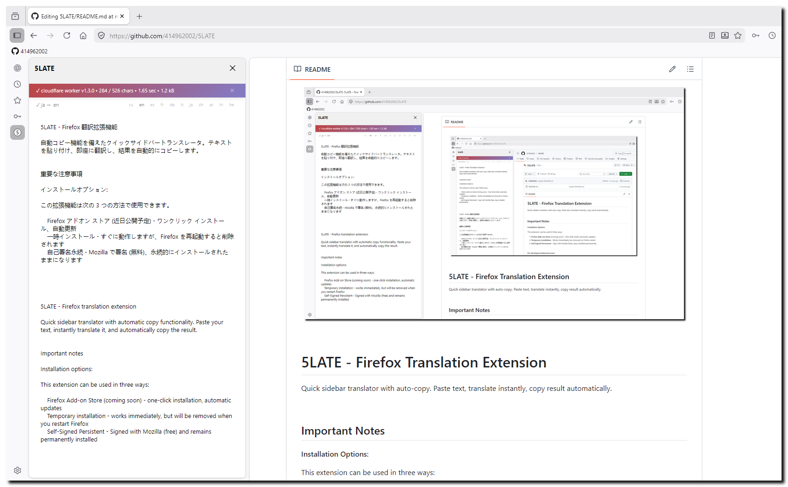

<br clear="all">

# 5LATE - Firefox Translation Extension

Quick sidebar translator with auto-copy. Paste text, translate instantly, copy result automatically.

&nbsp;

## Important Notes

**Installation Options:**

This extension can be used in three ways:

1. **Firefox Add-ons Store** (Coming soon) - One-click install, automatic updates
2. **Temporary Installation** - Works immediately but removed on Firefox restart
3. **Self-Signed Permanent** - Sign with Mozilla (free), stays installed permanently

&nbsp;

**For developers/advanced users:**

- Temporary installation is quick for testing but resets every Firefox restart
- For permanent use, you must sign the extension with Mozilla (takes 5-10 minutes, free)
- Firefox blocks unsigned extensions for security reasons

See installation instructions below for details.

&nbsp;

## Features

- Auto translation after 1.5 seconds
- Auto language detection (11 languages)
- Smart EN↔RU auto-swap
- Auto-copy to clipboard
- Sidebar mode (persistent state)
- Tab mode (temporary session)
- Cloudflare Worker proxy (optional)
- Rate limiting (100 req/min per IP)
- Daily rotating token authentication

&nbsp;

## Option 1: Firefox Add-ons Store (Recommended)

### Download Signed Extension

1. Download: [5late-1.3.0.xpi](https://github.com/414962002/5SLATE/releases/download/v1.3.0/65f33d6a9f6b4a9d91b7-1.3.0.xpi)
2. Firefox → about:addons
3. Gear icon → Install Add-on From File
4. Select downloaded .xpi file
5. Confirm installation

&nbsp;

### Option 2: Temporary Installation (Quick Testing)

**Best for:** Testing, development, short-term use

**Limitations:** Extension is removed when Firefox restarts

**Steps:**

**Step 1: Download**

Clone or download this repository.

&nbsp;

**Step 2: Open Firefox**

Go to `about:debugging#/runtime/this-firefox`

&nbsp;

**Step 3: Load Extension**

1. Click "Load Temporary Add-on"
2. Navigate to extension folder
3. Select `manifest.json`
4. Extension is now loaded

&nbsp;

**Step 4: Open Sidebar**

Click the extension icon in Firefox toolbar.

&nbsp;

**Note:** You must reload the extension every time Firefox restarts.

&nbsp;

### Option 3: Permanent Installation (Self-Signed)

**Best for:** Daily use, permanent installation

**Requirements:** Mozilla account (free)

**Steps:**

**Step 1: Download and Prepare**

1. Download this repository
2. Zip the extension files (manifest.json, sidebar.js, etc.)
3. Make sure all files are in the root of the zip (not in a subfolder)

&nbsp;

**Step 2: Sign with Mozilla**

1. Create account: https://addons.mozilla.org/developers/
2. Go to: https://addons.mozilla.org/developers/addon/submit/distribution
3. Choose "On your own" (self-distribution)
4. Upload your .zip file
5. Mozilla validates and signs (5-10 minutes)
6. Download the signed .xpi file

&nbsp;

**Step 3: Install Signed Extension**

1. Firefox → `about:addons`
2. Click gear icon → "Install Add-on From File"
3. Select the signed .xpi file
4. Confirm installation

&nbsp;

**Step 4: Open Sidebar**

Click the extension icon in Firefox toolbar.

&nbsp;

**Note:** Extension stays installed permanently, survives Firefox restart.

&nbsp;

## Setup Cloudflare Worker (Optional)

For better reliability and rate limiting, deploy your own Cloudflare Worker proxy.

### Step 1: Create Cloudflare Account

Sign up at https://dash.cloudflare.com/sign-up (free tier available)

&nbsp;

### Step 2: Get API Token

1. Dashboard → Manage Account → API Tokens
2. Create Token → Edit Cloudflare Workers
3. Copy token (save it securely)

&nbsp;

### Step 3: Get Account ID

1. Go to https://dash.cloudflare.com/
2. URL shows: `https://dash.cloudflare.com/<ACCOUNT_ID>/...`
3. Copy the 32-character hex string

&nbsp;

### Step 4: Create Worker (Get Worker Name)

1. Dashboard → Workers & Pages
2. Create Application → Create Worker
3. Name it (e.g., "5late-translator")
4. Deploy (don't edit code yet)
5. Copy worker URL: `https://5late-translator.workers.dev`

&nbsp;

### Step 5: Configure deploy.ps1

Open `deploy.ps1` and update:

```powershell
$ACCOUNT_ID = "your_account_id_here"
$API_TOKEN = "your_api_token_here"
$SCRIPT_NAME = "5late-translator"
```

&nbsp;

### Step 6: Configure SECRET_SALT

Generate random string (20+ characters):

```
my-dog-loves-pizza-on-tuesday-2026
k9Lm3pQr7sWx2Yz5Aa8Bb1Cc4Dd6Ee0
```

Update in both files (MUST BE THE SAME):

**File 1:** `worker.js` (line 15)

```javascript
const SECRET_SALT = "your-random-secret-here";
```

**File 2:** `sidebar.js` (line 7)

```javascript
const SECRET_SALT = "your-random-secret-here";  // Same as worker.js
```

&nbsp;

### Step 7: Deploy Worker Code

```powershell
powershell -ExecutionPolicy Bypass -File .\deploy.ps1
# Choose option 2 (Upload)
```

&nbsp;

### Step 8: Update Extension Worker URL

Open `sidebar.js` and update:

```javascript
const WORKER_URL = "https://5late-translator.workers.dev/translate";
```

&nbsp;

### Step 9: Reload Extension

Firefox → `about:debugging` → Reload extension

&nbsp;

### Step 10: Test

Translate something in the sidebar. Check status line shows "cloudflare worker".

&nbsp;

## Configuration

### SECRET_SALT

A shared secret between extension and worker for authentication.

**Generate random string:**

```
my-dog-loves-pizza-on-tuesday-2026
k9Lm3pQr7sWx2Yz5Aa8Bb1Cc4Dd6Ee0
```

**Set in both files:**

- Extension: `sidebar.js` (line 7)
- Worker: `worker.js` (line 15)

**Must be the same in both files!**

See `docs/SALT_SUMMARY.md` for details.

&nbsp;

### Deploy Script (deploy.ps1)

PowerShell script to upload/download worker code.

**Configure:**

```powershell
$ACCOUNT_ID = "your_cloudflare_account_id_here"
$API_TOKEN = "your_cloudflare_api_token_here"
$SCRIPT_NAME = "your-worker-name-here"
```

**Run:**

```powershell
cd worker
powershell -ExecutionPolicy Bypass -File .\deploy.ps1
```

See `docs/WORKER_WORKFLOW.md` for details.

&nbsp;

## Usage

1. Click extension icon to open sidebar
2. Paste text into input field
3. Wait 1.5 seconds (auto-translate)
4. Translation auto-copied to clipboard
5. Paste anywhere (Ctrl+V)

&nbsp;

## Supported Languages

Russian, English, Spanish, French, German, Italian, Japanese, Chinese, Arabic, Hindi, Hebrew

&nbsp;

## Documentation

- `docs/SALT_SUMMARY.md` - SECRET_SALT configuration guide
- `docs/WORKER_WORKFLOW.md` - Cloudflare Worker deployment guide
- `docs/CLOUDFLARE_SUMMARY.md` - Detailed Cloudflare setup

&nbsp;

## Architecture

```
Extension → Cloudflare Worker → Google Translate
```

**Fallback system:**

1. Cloudflare Worker → Google GTX
2. Direct → Google GTX
3. Direct → Google clients5

&nbsp;

## Security

- Daily rotating tokens (SHA-256)
- Rate limiting (100 req/min per IP)
- No user accounts or tracking
- No persistent data storage (except sidebar state)
- Open source (auditable code)

&nbsp;

## License

Open source - see LICENSE file for details.

&nbsp;

---
04.04.26  
**Version:** 1.3.0  
**Status:** Production Ready  

